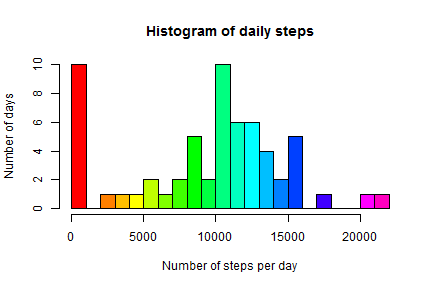
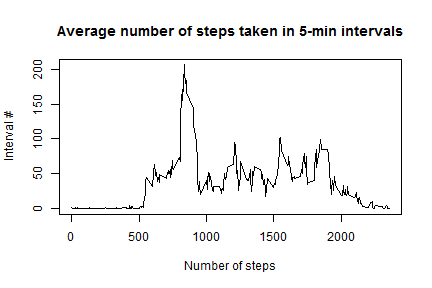
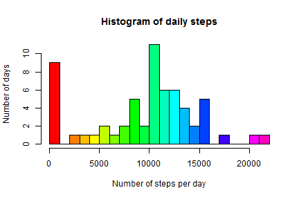
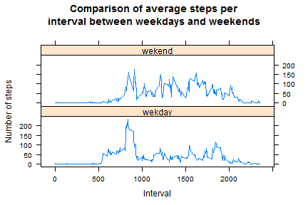

# Reproducible Research: Peer Assessment 1


## Loading and preprocessing the data


Read data, prepare values:


```r
data <- read.csv("activity.csv")
data$date<- as.Date(data$date)
data$interval<- as.numeric(data$interval)
```


## What is mean total number of steps taken per day?

Calculate daily steps, discarding NA values:


```r
stepsByDay <- aggregate(data$steps, by=list(cdate=data$date), FUN=sum,na.rm = TRUE)

names(stepsByDay)<-c("date","steps")
```

  
Draw histogram:


```r
hist(stepsByDay$steps, breaks=20 ,
  col=rainbow(24),
  xlab="Number of steps per day",
  ylab="Number of days",
  main="Histogram of daily steps")
```

 


Calculate the mean and the median for the daily number of steps:

```r
mean(stepsByDay$steps)
```

```
## [1] 9354
```

```r
median(stepsByDay$steps)
```

```
## [1] 10395
```

## What is the average daily activity pattern?

Calculate average number of steps for each interval across all days:


```r
stepsByInterval <- aggregate(data$steps, by=list(data$interval), FUN=mean,na.rm = TRUE)

names(stepsByInterval)<-c("interval","steps")
```

Draw histogram:


```r
plot(stepsByInterval$interval,stepsByInterval$steps, 
     type="l",
     main="Average number of steps taken in 5-min intervals",xlab="Number of steps",
     ylab="Interval #"
)
```

 


Find the interval with the maximum number of steps (in average):


```r
max(stepsByInterval$steps)
```

```
## [1] 206.2
```

```r
stepsByInterval$interval[which.max(stepsByInterval$steps)]
```

```
## [1] 835
```


## Imputing missing values

The number of observation with missing values:


```r
nrow(subset(data,is.na(data$steps)))
```

```
## [1] 2304
```

I will create another data set by replacing the missing values with the average ones for each interval calculated before


```r
data2 <-data
  
data2$steps[is.na(data$steps)] <-stepsByInterval$steps[data$interval == stepsByInterval$interval]
```


Draw the histogram of the new data set for the daily number of steps:


```r
stepsByDay2 <- aggregate(data2$steps, by=list(data2$date), FUN=sum,na.rm = TRUE)


names(stepsByDay2)<-c("date","steps")


hist(stepsByDay2$steps, breaks=20 ,
     col=rainbow(24),
     xlab="Number of steps per day",
     ylab="Number of days",
     main="Histogram of daily steps")
```

 

Calculate the mean and median for the new set:

```r
mean(stepsByDay2$steps)
```

```
## [1] 9531
```

```r
median(stepsByDay2$steps)
```

```
## [1] 10439
```

The mean and the median increases, as we added new values instead of zeros (where available).


## Are there differences in activity patterns between weekdays and weekends?

Add new factor - daytype:


```r
data2$daytype <- 'wekday'

data2$daytype[weekdays(data2$date) == "Sunday" | weekdays(data2$date) == "Saturday"] <- 'wekend'
```

Calculate the average number of steps for each interval across all days:


```r
stepsByInterval2 <- aggregate(data2$steps, by=list(data2$daytype,data2$interval), FUN=mean,na.rm = TRUE)


names(stepsByInterval2)<-c("daytype","interval","steps")
```

Plot the average number of steps for each interval, comparing the weekdays to weekends:


```r
library(lattice)
xyplot(stepsByInterval2$steps ~ stepsByInterval2$interval | stepsByInterval2$daytype, 
       layout = c(1, 2), type = "l", xlab = "Interval", ylab = "Number of steps",
       main="Comparison of average steps per\ninterval between weekdays and weekends")
```

 
